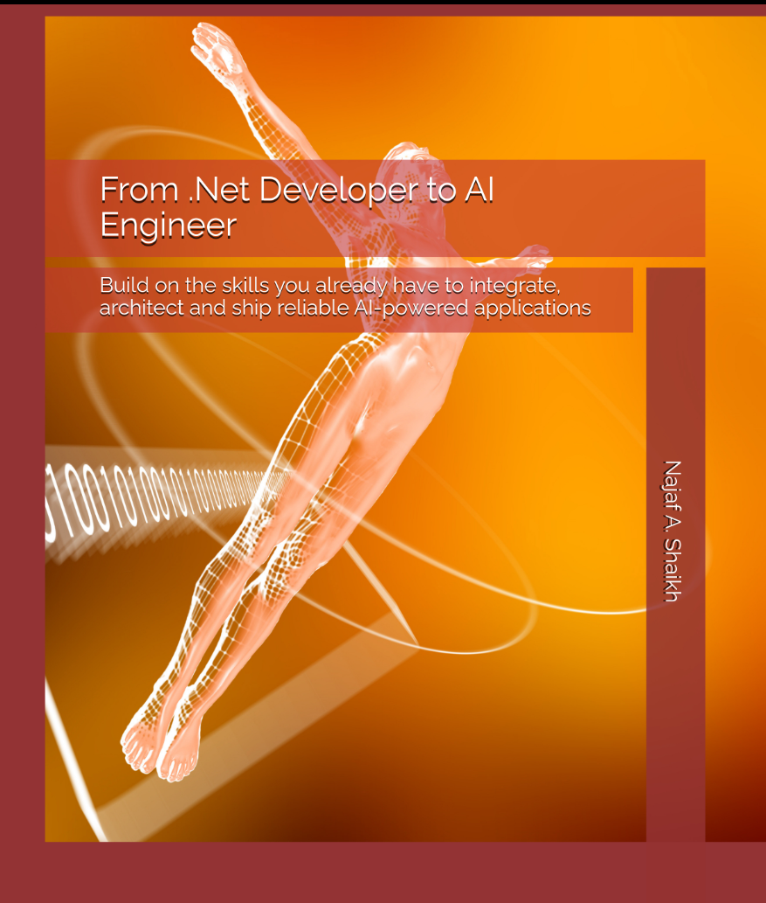

# Companion Code Repository



**From .NET Developer to AI Engineer**
*By Najaf A. Shaikh · First Edition, 2026*
> Build on the skills you already have to integrate, architect and ship reliable AI-powered applications

---

## Overview

**Runnable code samples** - Every project in this repo corresponds to a section of the book. Chapter folders and topic folders are named after the chapters and sections they support, so `Chapter09-RAG/9.9-PolicyAssistant` backs Section 9.9. When a listing in the book comes from a companion project, the text names the topic folder and project, for example `9.9-PolicyAssistant/Ch09.PolicyAssistant`. The samples follow one running example, Northwind Traders and its customer assistant **Northwind Assist**, from a first model call in Chapter 1 to a production-shaped application in Chapter 16.

> **About this code.** These are **teaching samples**, not production-grade libraries. Each project demonstrates the techniques of one section, written for clarity over coverage. The patterns are real and reusable: provider-neutral clients, structured output with validation, safe tools, RAG with citations, bounded agents, prompt-injection defenses, evaluation, telemetry, resilience and cost routing. Even the Chapter 16 capstone runs on in-memory stores and a demo sign-in, though. Hardening, threat-modeling and cost-bounding the code for your environment is your responsibility.

---

## Layout

```text
sample-code/
├── NorthwindAI.slnx                        -- one solution covering every project and test
├── Directory.Build.props                   -- .NET 10, nullable, implicit usings, shared User Secrets id
├── Directory.Packages.props                -- centralized NuGet versions with transitive pinning
├── global.json                             -- .NET 10 SDK pin + Microsoft.Testing.Platform runner
├── dotnet-tools.json                       -- local tools: the aieval evaluation report generator
├── Shared/
│   ├── Northwind.Shared/                   -- provider factory, domain + seed data, tools, RAG pipeline,
│   │                                          structured output, security components, test doubles
│   └── Northwind.Agents/                   -- agent context providers + action rate limiter
├── Chapter01-From-DotNet-To-AI-Engineer/
│   └── 1.6-SetupCheck/                     -- One question to your provider, with token usage
├── Chapter02-LLM-Fundamentals/
│   ├── 2.2-Tokenization/                   -- Token counts and individual tokens (o200k_base)
│   ├── 2.4-Embeddings/                     -- Cosine similarity between sentence embeddings
│   ├── 2.5-Inference/                      -- Time to first token, output speed, Length finish reason
│   ├── 2.6-Sampling/                       -- One prompt at three temperatures, side by side
│   └── 2.7-ModelSelection/                 -- Monthly cost comparison from a price list
├── Chapter03-Prompt-Engineering/
│   ├── 3.1-MessageRoles/                   -- Chat loop in which the application owns the history
│   ├── 3.3-FewShot/                        -- Ticket classification with and without examples
│   ├── 3.5-ContextManagement/              -- Token-budgeted history + summarizing chat reducer
│   ├── 3.6-PromptTemplates/                -- Versioned prompt files with front matter
│   └── 3.7-PromptTesting/                  -- Template tests + opt-in golden-set accuracy test
├── Chapter04-Microsoft-Extensions-AI/
│   ├── 4.3-ChatClient/                     -- IChatClient basics, cancellation, multimodal input
│   ├── 4.4-Streaming/                      -- SSE streaming from a minimal API, with an HTML client
│   ├── 4.5-Embeddings/                     -- Batched IEmbeddingGenerator, dimensions, caching
│   ├── 4.6-Middleware/                     -- Logging, caching, usage tracking, OpenTelemetry pipeline
│   └── 4.7-ProviderSwitching/              -- Same code on any provider + FakeChatClient unit tests
├── Chapter05-Structured-Outputs/
│   ├── 5.3-TypedResponses/                 -- GetResponseAsync<T>() and the generated JSON schema
│   ├── 5.4-ValidationAndRetries/           -- Validation, source checks, validate-and-retry loop
│   └── 5.5-Patterns/                       -- Classification, extraction, transformation, batching
├── Chapter06-Tool-Calling/
│   ├── 6.2-FunctionTools/                  -- AIFunctionFactory + automatic function invocation
│   ├── 6.3-ServiceTools/                   -- ASP.NET Core tools bound to the signed-in customer
│   ├── 6.4-ManualInvocation/               -- Hand-written tool loop, audit log, refund approvals
│   └── 6.5-SafeTools/                      -- Authorization, validation, idempotency, computed amounts
├── Chapter07-Local-and-Open-Models/
│   ├── 7.4-OllamaChat/                     -- Ollama through IChatClient: streaming, typed output, tools
│   └── 7.5-HybridRouting/                  -- Sensitive requests to a local model, the rest to the cloud
├── Chapter08-Vector-Databases/
│   ├── 8.2-SimilaritySearch/               -- Cosine, dot product, Euclidean + brute-force benchmark
│   ├── 8.3-HybridSearch/                   -- BM25 + vector search merged with Reciprocal Rank Fusion
│   └── 8.6-VectorStore/                    -- Microsoft.Extensions.VectorData collection lifecycle
├── Chapter09-RAG/
│   ├── 9.3-Chunking/                       -- Structure-aware Markdown chunking of the policy library
│   ├── 9.8-Reranking/                      -- Vector candidates re-graded by a language model
│   └── 9.9-PolicyAssistant/                -- End-to-end RAG chat with filters and validated citations
├── Chapter10-Microsoft-Agent-Framework/
│   ├── 10.3-FirstAgent/                    -- ChatClientAgent, RunAsync and RunStreamingAsync
│   ├── 10.4-Sessions/                      -- AgentSession persisted to disk across restarts
│   ├── 10.5-ToolsAndMiddleware/            -- Approval-required tools + three kinds of middleware
│   ├── 10.6-ContextProviders/              -- Customer profile, policy retrieval and memory providers
│   └── 10.8-Workflows/                     -- Triage and refund workflows, approvals, checkpoints
├── Chapter11-Model-Context-Protocol/
│   ├── 11.4-BuildingAServer/               -- Tools, resources and prompts over stdio and Streamable HTTP
│   └── 11.5-ConsumingServers/              -- MCP client used from an IChatClient and from an agent
├── Chapter12-AI-Agents/
│   ├── 12.3-Orchestrations/                -- Sequential, concurrent, group chat, agent-as-tool
│   ├── 12.4-Handoffs/                      -- Triage agent handing off to specialist agents
│   └── 12.7-Guardrails/                    -- Invocation limits, error limits, token budgets, timeouts
├── Chapter13-AI-Security/
│   ├── 13.2-PromptInjection/               -- Prompt Shields or heuristic detection, restricted mode
│   ├── 13.3-SensitiveData/                 -- RedactingChatClient + output leak scanning
│   ├── 13.4-OutputHandling/                -- Sanitizing model output into safe HTML
│   ├── 13.5-ExcessiveAgency/               -- Red-team xUnit tests against a scripted model
│   └── 13.6-VectorSecurity/                -- Poisoned-content quarantine + tenant-filtered retrieval
├── Chapter14-AI-Evaluation/
│   ├── 14.3-QualityEvaluators/             -- Relevance, coherence, groundedness, completeness
│   ├── 14.5-CustomEvaluators/              -- Deterministic citation + model-graded policy evaluators
│   └── 14.6-EvaluationTests/               -- Golden dataset as xUnit tests with cached responses
├── Chapter15-AI-Observability/
│   └── 15.6-OpenTelemetry/                 -- Instrumented API + Aspire dashboard (Docker Compose)
├── Chapter16-Production-Architecture/
│   ├── 16.2-ReferenceArchitecture/         -- The capstone: Northwind Assist as a production-shaped API
│   ├── 16.3-Resilience/                    -- Timeouts, retries, circuit breaker, fallback deployments
│   └── 16.5-CostAndScale/                  -- Complexity routing + semantic answer cache
└── Chapter17-Your-Path-Forward/
    └── 17.3-PortfolioStarter/              -- Self-contained API + evaluation tests for your portfolio
```

Each chapter folder has its own `README.md` listing its projects, the sections they support, how to run them and what to look for in the output. Each topic folder contains one or more projects named `ChNN.<Project>`.

## Prerequisites

- **.NET 10 SDK** (10.0.100 or later). `global.json` pins the SDK band and opts in to Microsoft.Testing.Platform for `dotnet test`.
- **A model provider**, one of:
  - **[Ollama](https://ollama.com)** for local models, with no account or API key. Pull the two default models:
    ```bash
    ollama pull llama3.2
    ollama pull nomic-embed-text
    ```
  - **Azure OpenAI**, through Microsoft Foundry, signed in with `az login` (Microsoft Entra ID) or with an API key.
  - **OpenAI**, with an API key.
- **Docker** (optional), for the Aspire dashboard in Chapter 15.
- **An editor**: Visual Studio 2026, Visual Studio Code with the C# Dev Kit, or Rider.

The repo uses **central package management**. Versions live in [`Directory.Packages.props`](Directory.Packages.props) and shared MSBuild properties in [`Directory.Build.props`](Directory.Build.props). Project files only carry `<PackageReference Include="..." />`, with no version attributes.

## Quick start

```bash
git clone https://github.com/CodeShayk/ai-engineer-dotnet-samples.git sample-code
cd sample-code
dotnet build NorthwindAI.slnx
dotnet run --project Chapter01-From-DotNet-To-AI-Engineer/1.6-SetupCheck/Ch01.SetupCheck
```

Cloning into a folder named `sample-code` makes your copy match the paths used throughout the book, such as `sample-code/Chapter09-RAG`.

With nothing configured, every sample uses a local Ollama server at `http://localhost:11434` with `llama3.2` and `nomic-embed-text`.

## Configuration and secrets

All samples read configuration in the standard .NET cascade: `appsettings.json`, then User Secrets, then environment variables. **No sample contains a hardcoded API key.**

Every project shares one User Secrets store, with the id `northwind-ai-engineer-samples`, so you configure a provider once and every chapter picks it up. Environment variables override User Secrets (use `__` for `:`, for example `AI__Provider`).

```bash
# Azure OpenAI (Microsoft Entra ID; add AI:ApiKey only if you must use a key)
dotnet user-secrets set "AI:Provider" "AzureOpenAI" --id northwind-ai-engineer-samples
dotnet user-secrets set "AI:Endpoint" "https://<your-resource>.openai.azure.com/openai/v1/" --id northwind-ai-engineer-samples
dotnet user-secrets set "AI:ChatDeployment" "gpt-5-mini" --id northwind-ai-engineer-samples
dotnet user-secrets set "AI:EmbeddingDeployment" "text-embedding-3-small" --id northwind-ai-engineer-samples

# OpenAI
dotnet user-secrets set "AI:Provider" "OpenAI" --id northwind-ai-engineer-samples
dotnet user-secrets set "AI:ApiKey" "<your key>" --id northwind-ai-engineer-samples
```

| Key | Ollama default | Azure OpenAI / OpenAI default | Used for |
|---|---|---|---|
| `AI:Provider` | `Ollama` | | `Ollama`, `AzureOpenAI` or `OpenAI` |
| `AI:Endpoint` | `http://localhost:11434` | required for Azure | The service endpoint. For Azure, the v1 endpoint ending in `/openai/v1/`. |
| `AI:ApiKey` | | required for OpenAI | Azure prefers Microsoft Entra ID when no key is set. |
| `AI:ChatDeployment` | `llama3.2` | `gpt-5-mini` | The main chat model. |
| `AI:SmallChatDeployment` | the chat model | the chat model | Rewriting, reranking, triage and routing (Chapters 3, 9, 16). |
| `AI:JudgeChatDeployment` | the chat model | the chat model | The evaluation judge (Chapter 14). Use a capable model. |
| `AI:EmbeddingDeployment` | `nomic-embed-text` | `text-embedding-3-small` | Embeddings (Chapters 2, 4, 8, 9 onward). |
| `AI:EmbeddingDimensions` | `768` | `1536` | Must match the embedding model. |
| `AI:ReasoningDeployments` | | names starting `gpt-5`, `o1`, `o3` or `o4` are detected | Comma-separated deployments that serve reasoning models but whose names don't say so. The factory removes the sampling settings (temperature, top-p, penalties) these models reject. |

A few chapters read settings of their own; the chapter READMEs describe them:

| Keys | Chapters | Purpose |
|---|---|---|
| `Ollama:Endpoint`, `Ollama:ChatModel` | 7 | The local model for the local-inference samples, whatever `AI:Provider` is. |
| `McpServer:ApiKey`, `McpServer:Endpoint` | 11, 16 | The API key for the HTTP MCP server, and where clients find it. |
| `ContentSafety:Endpoint`, `ContentSafety:ApiKey` | 13, 16 | Azure AI Content Safety Prompt Shields. Heuristics are used when unset. |
| `Authentication:Authority`, `Authentication:Audience` | 16 | JWT bearer authentication. A demo scheme is used in Development when unset. |
| `AI:Fallback:ChatDeployment`, `AI:Fallback:Endpoint` | 16 | A secondary deployment for fallback. |
| `Telemetry:ConsoleExporter`, `OTEL_EXPORTER_OTLP_ENDPOINT` | 15 | Where telemetry goes. |

For anything beyond a developer workstation (CI, shared environments, deployed services), use your platform's secret manager, such as Azure Key Vault, and managed identity rather than keys. Do not commit files containing keys. The repo's `.gitignore` excludes `*.env` and `appsettings.Development.local.json`, but the responsibility is yours.

## Running a sample

```bash
dotnet run --project Chapter09-RAG/9.9-PolicyAssistant/Ch09.PolicyAssistant
```

Each chapter folder's `README.md` has the run commands for its projects, the command-line switches they accept, and what to look for in the output.

## Building everything

```bash
dotnet build NorthwindAI.slnx
```

builds every project across all chapters. The solution folders follow the same chapter and topic structure, so you can also open the whole book's code at once in Visual Studio, Visual Studio Code or Rider.

## Running tests

The test projects use xUnit v3 on Microsoft.Testing.Platform. Run them with `--project`:

```bash
dotnet test --project Chapter03-Prompt-Engineering/3.7-PromptTesting/Ch03.PromptTests
dotnet test --project Chapter04-Microsoft-Extensions-AI/4.7-ProviderSwitching/Ch04.ProviderSwitching.Tests
dotnet test --project Chapter13-AI-Security/13.5-ExcessiveAgency/Ch13.ExcessiveAgency
dotnet test --project Chapter14-AI-Evaluation/14.6-EvaluationTests/Ch14.EvaluationTests
dotnet test --project Chapter17-Your-Path-Forward/17.3-PortfolioStarter/Ch17.PortfolioStarter.EvaluationTests
```

Tests that call a live model are skipped unless `RUN_MODEL_TESTS=true`, so every test project is safe to run in any build:

```powershell
$env:RUN_MODEL_TESTS = "true"; dotnet test --project Chapter14-AI-Evaluation/14.6-EvaluationTests/Ch14.EvaluationTests
```

## What's offline-runnable

Every sample runs against a local Ollama server, with no API key and no cloud calls. These go further and need **no model at all**, which makes them a good place to start reading code:

| Project | Command |
|---|---|
| Tokenization and cost estimation | `dotnet run --project Chapter02-LLM-Fundamentals/2.2-Tokenization/Ch02.Tokenization` (and `2.7-ModelSelection/Ch02.CostEstimator`) |
| Manual invocation and approvals with a scripted model | `dotnet run --project Chapter06-Tool-Calling/6.4-ManualInvocation/Ch06.ManualInvocation -- --offline` |
| Refund tool safeguards | `dotnet run --project Chapter06-Tool-Calling/6.5-SafeTools/Ch06.SafeTools -- --offline` |
| Hybrid routing decisions | `dotnet run --project Chapter07-Local-and-Open-Models/7.5-HybridRouting/Ch07.HybridRouting -- --offline` |
| Brute-force search benchmark | `dotnet run --project Chapter08-Vector-Databases/8.2-SimilaritySearch/Ch08.SimilarityMetrics -- --offline` |
| Chunking | `dotnet run --project Chapter09-RAG/9.3-Chunking/Ch09.Chunking` |
| Security samples | `--offline` on the 13.2, 13.3 and 13.6 projects; 13.4 needs no flag |
| Red-team tests | `dotnet test --project Chapter13-AI-Security/13.5-ExcessiveAgency/Ch13.ExcessiveAgency` |
| Citation evaluator | `dotnet run --project Chapter14-AI-Evaluation/14.5-CustomEvaluators/Ch14.CustomEvaluators -- --offline` |
| Resilience and fallback | `dotnet run --project Chapter16-Production-Architecture/16.3-Resilience/Ch16.ResilientChatClient` |

## Choosing a model

Everything runs on Ollama's defaults, and the samples were verified with `llama3.2` and `nomic-embed-text`. A 3-billion-parameter model is, however, much weaker than current cloud models at tool calling, following grounding rules and judging other answers. You will see it skip tools, describe a handoff instead of performing one, answer "I'm not sure" more often, or invent a detail its sources do not contain. The samples report these failures rather than hiding them, and several chapters are about catching exactly these failures.

For the multi-agent samples (Chapters 10 to 12 and 16) and the evaluation judge (Chapter 14), configure a cloud provider or a larger tool-capable local model such as `qwen3`.

## Cost expectations

With Ollama, every sample is free to run. With Azure OpenAI or OpenAI, the samples spend real money against your account. Most send a handful of short requests and cost very little with a small model such as `gpt-5-mini`. The ones worth watching:

- **RAG and agents** (Chapters 9, 10, 12 and 16) make several model calls per question, for query rewriting, reranking, tool calls and handoffs, and the policy library is embedded at startup.
- **Evaluation** (Chapters 14 and 17) issues judge calls for every evaluated response, and a capable judge model costs more per call. Responses from both the system under test and the judge are cached in `eval-results`, so a repeat run with no changes costs almost nothing.
- **The Chapter 15 demo traffic endpoint** sends a batch of requests through every path each time you call it.

If you run any sample unattended (CI, scheduled jobs, scripts), set spend limits in your provider's console first.

## Notes

- **Prices and model names are illustrative.** Replace them with your provider's current models and rates. `Chapter02-LLM-Fundamentals/2.7-ModelSelection/Ch02.CostEstimator/costsettings.json` and `Chapter15-AI-Observability/15.6-OpenTelemetry/Ch15.ObservableAssistant/appsettings.json` hold the price lists.
- **Package names and APIs move.** The AI libraries used here have been renamed and reshaped several times. When a sample fails to restore or build after an upgrade, check the chapter's further reading link and the package's NuGet page before assuming the code is wrong.
- **Experimental APIs.** Some APIs used in the book are flagged as experimental by their authors. `Directory.Build.props` suppresses those warnings (`OPENAI001`, `MEAI001`, `MAAI001`, `MCPEXP001`, `AIEVAL001`) so they do not drown out real problems. If you copy code into your own project, expect to see them.
- **Vector store connectors** come from the .NET Community Toolkit (`CommunityToolkit.VectorData.*`). Keep the connector and `Microsoft.Extensions.VectorData.Abstractions` versions in step; Chapter 8 explains why.
- **Demo authentication.** The ASP.NET Core samples in Chapters 6 and 16 sign callers in from request headers so that they run without an identity provider. That scheme is only enabled in the Development environment.
- **Generated output.** Evaluation results are written to `eval-results`, and agent sessions from Chapter 10 to a `sessions` folder next to the executable. Both are excluded from source control.

## Versioning and tags

| Tag | Meaning |
|---|---|
| `v1.0-first-print` | Code as it appears in the first edition of the book. |
| `master` | Always current. Tracks the latest stable .NET 10 and AI library releases, so it may drift from the printed listings. |

If a listing in the book no longer matches `master`, check out the tag for your edition.

## Contributing

Issues are welcome: bugs, builds broken by package updates, samples whose APIs have moved on, and README mistakes. Pull requests are welcome too, especially:

- Build fixes for newer NuGet releases.
- README clarifications, per chapter or repo-wide.
- Offline variants of samples that currently need a model.

Before opening a pull request, run `dotnet build NorthwindAI.slnx` and `dotnet test` from the repo root, and confirm the affected samples still run. If you change observable behavior, update the chapter's README.

## Errata

Open an issue at [github.com/CodeShayk/ai-engineer-dotnet-samples](https://github.com/CodeShayk/ai-engineer-dotnet-samples/issues). Confirmed errata in the code are fixed on `master` and roll into the next print tag.
